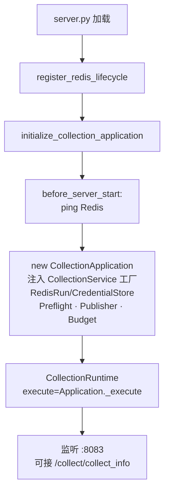
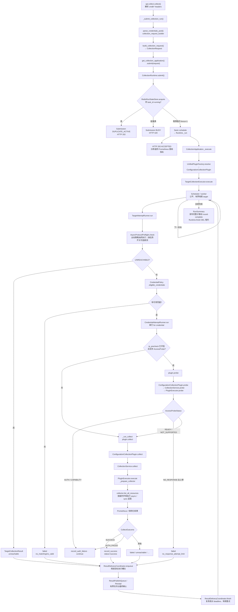
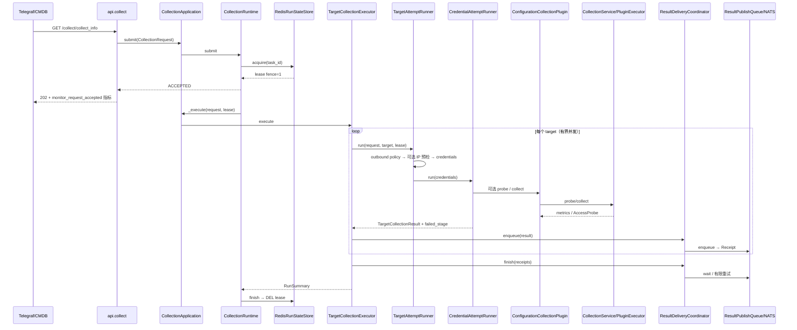

# Stargazer 采集 · 重构后层级与配置采集代码流程图

在 IDE 中打开本文件并用 **Markdown Preview** 查看 Mermaid 图。

---

## 1. 代码层级（重构后 · 包分类）

```text
core/
  logger.py / config.py / decorator.py   # 共享入口
  collection/                            # 统一异步采集运行时
    application.py · runtime.py · executor.py
    target_attempt.py · credential_attempt.py · result_delivery.py
    contracts.py · enums.py · constants.py
    plugins.py · request_builder.py · result_publisher.py
    preflight.py · credential_policy.py · metrics.py · redis_state.py
    host_remote/{adapter,callback,runtime}.py
  plugin/                                # YAML 插件加载执行
    executor.py · source_resolver.py · yaml_reader.py
  infra/                                 # Redis / NATS / SSH / 出站等
    redis_*.py · nats*.py · ansible_rpc.py · ssh_client.py …
  monitor/                               # 既有监控驱动（保留）
```

旧平铺路径（如 `core.collection_application`）已删除，统一使用上表包路径。

---

## 2. 服务启动（before_server_start）



---

## 3. 一次配置采集 · 代码执行流程图

以 `GET /collect/collect_info`（`model_id=mysql` 等）为例。函数名为当前代码真实符号。



HTTP 与后台采集的时序：



---

## 4. 关键调用栈（配置采集成功路径）

```
server.py
└─ api/collect.py::collect
   └─ _submit_collection_run
      ├─ parse_credentials_pool          # collection_request_builder
      ├─ build_collection_request
      └─ CollectionApplication.submit
         └─ CollectionRuntime.submit
            ├─ RedisRunStateStore.acquire
            └─ schedule → _run → CollectionApplication._execute
               ├─ UnifiedPluginFactory.resolve → ConfigurationCollectionPlugin
               └─ TargetCollectionExecutor.execute
                  ├─ TargetAttemptRunner.run
                  │  ├─ AsyncProtocolPreflight.check
                  │  ├─ CredentialPolicy.eligible_credentials
                  │  └─ CredentialAttemptRunner.run
                  │     ├─ plugin.probe（仅 params.ip_precheck 开启）
                  │     │  → CollectionService.probe → PluginExecutor.probe
                  │     └─ plugin.collect
                  │        → CollectionService.collect → PluginExecutor.execute
                  │           → collector.list_all_resources()
                  └─ ResultDeliveryCoordinator
                     ├─ enqueue → ResultPublishQueue → Receipt
                     └─ finish → Receipt.wait → 有界重试
                           → NatsResultPublisher → publish_metrics_to_nats
```

---

## 5. 与「监控 / 主机 remote」的分叉（对照）

| 步骤 | 配置采集 | 主机监控 `/monitor/host` |
|------|----------|--------------------------|
| Factory | `ConfigurationCollectionPlugin` | `MonitorCollectionPlugin` |
| probe | `CollectionService.probe` | `NOT_SUPPORTED`（跳过） |
| collect | `PluginExecutor` → 插件 | `host_remote_adapter.submit_host_remote_collection` |
| 发布 | 即时 NATS metrics | `DEFERRED` → Ansible 回调后再发 |

---

Source: 当前 `agents/stargazer` 重构后代码（薄租约 · contracts · 无 checkpoint）。
