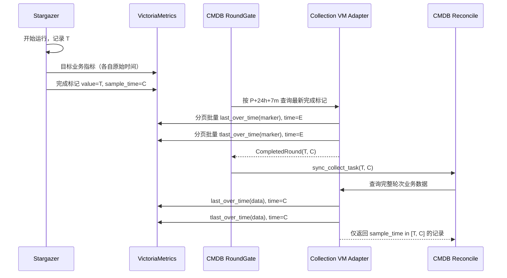

# VM 配置采集查询窗口实施方案

Status: implemented

## 1. 目标

解决配置采集的“采集周期与 VM 查询周期冲突”问题：长周期任务、CMDB/Gate/VM
故障恢复或游标重建时，不得因为默认 `1h` 查询窗口漏掉最近一次完整采集运行。

本次只调整 VictoriaMetrics 配置采集对账链路；K8s 保持原有按任务周期更新逻辑。

## 2. 已确认事实

- `sync_collect_tasks_gate` 每 5 分钟运行一次；
- `Collection.query()` 默认使用 `last_over_time(...[1h:])`；
- Gate 查询完成标记时未传轮次或周期，因此当前固定查询最近 `1h`；
- Stargazer 在采集运行开始时产生 `round_ts`，业务指标全部进入发布终态后发布完成标记；
- 完成标记的指标值是运行开始时间，标记原始样本时间是运行完成时间；
- VM instant query 返回的 `value[0]` 是查询评估时间，不能作为原始样本时间过滤轮次；
- 当前生产 VM retention 为 7 天，要求支持 24 小时故障恢复。

正常运行时，8 小时采集周期并不必然与 `1h` 冲突：完成标记发布后，Gate 通常在 5 分钟内
发现它。真正的缺陷发生在故障恢复、初始化、游标丢失和旧 Agent 兼容路径。

## 3. 核心决定

### 3.1 两个窗口分别负责两件事

设：

- `P`：当前采集通道的采集周期；设备通道取任务周期，拓扑通道取
  `topology_interval_minutes`；
- `R`：故障恢复目标，固定 24 小时；
- `G`：Gate 调度间隔，当前 5 分钟；
- `B`：落库和时钟缓冲，固定 2 分钟；
- `T`：采集运行开始时间；
- `C`：采集运行完成标记的原始样本时间。

完成标记发现窗口：

```text
marker_lookback = P + R + G + B
```

任务不是分钟循环周期或周期非法时，`P=0`，回退到 `24h07m`。

设备与拓扑分别计算窗口。例如设备周期 `8h`、拓扑周期 `40h` 时，设备标记窗口为
`32h07m`，拓扑标记窗口为 `64h07m`，两者不会复用同一个周期。

业务数据窗口：

```text
evaluation_time = C
round_lookback = C - T + B
accepted_sample_time = [T, C]
```

采集周期只决定向前寻找完成标记的范围，不直接决定业务数据查询范围。

### 3.2 为什么不是 `max(1h, P)`

`max(1h, P)` 只能减少漏查，不能隔离轮次：

- 只有下界，没有完成时间上界，可能读到下一轮尚未完成的数据；
- 会为 8 小时任务扫描 8 小时业务数据，而本轮实际可能只运行 10 分钟；
- 最坏恢复场景需要覆盖“一个采集周期 + 24 小时故障”，不是二者取最大值；
- 不能修复 instant query `value[0]` 被误当作原始样本时间的问题。

### 3.3 原始样本时间

保留现有 `/prometheus/api/v1/query` URL。轮次查询由 VM Adapter 在 Module 内完成两次查询：

```text
last_over_time(...)   -> 原指标值
tlast_over_time(...)  -> 最后一个原始样本的时间
```

两组结果按稳定指标标签配对，只返回原始样本时间位于 `[T, C]` 的原值记录。临时查询结果
不会给 VM 存储增加标签或时间序列。

完成标记查询按 Gate 分页批量执行：每页设备通道固定为一对查询，只有缺少新 role 标记的
任务才追加一对旧标记兼容查询；拓扑通道同样按页批量查询。没有任何标记的新任务，其
数据存在性兼容探测也按页合并为一次查询，不再逐任务访问 VM。它解决的是任务数量增长时的
HTTP 请求放大，不引入第二个 URL、slot 或存储结构。

两次查询使用完全相同的 instant query `time`，避免并发完成新轮次时拼出“旧 T + 新 C”。
`C` 全链路保留小数秒，Prometheus 文本标记使用毫秒时间戳，避免同秒业务样本被错误排除。

## 4. 目标链路



## 5. Module 与 Interface

`Collection` 是 VictoriaMetrics Adapter，继续提供一个稳定 Interface，并在内部隐藏 PromQL、
双查询配对、原始时间过滤和重试：

```python
Collection.query(
    sql,
    *,
    lookback_seconds=None,
    min_timestamp=None,
    max_timestamp=None,
)
```

- 无轮次参数：保持现有最新值查询语义；
- 同时给出 `min_timestamp/max_timestamp`：执行完整轮次查询；
- 只给出 `min_timestamp`：以当前时间为兼容上界，但仍按原始样本时间过滤。

`RoundGate` 使用 `CompletedRound(started_at, completed_at, labels)`。`labels` 中的
`snapshot_contract_version="2"` 是破坏性差异的协议证明；游标仍保存 `started_at`，不改变
`last_synced_round` 的已有语义。

## 6. 完整性与兼容边界

- 新 Stargazer 完成标记显式写入完成时间戳，确保 `T/C` 使用同一时钟；
- 新 Stargazer 标记携带 `snapshot_contract_version="2"`；只有该版本才允许删除；
- 旧标记没有显式时间戳时，VM 的实际写入时间仍可由 `tlast_over_time` 读取；
- 旧 Agent 的无版本标记即使包含 `T/C` 也只允许 Upsert，避免滚动升级时把旧 partial
  标记误当完整快照；同一 `T` 同时存在新旧标记时优先选择新协议标记；
- 没有完成标记的旧 Agent 只能走兼容查询，不能证明快照完整；
- 兼容查询显式标记 `snapshot_complete=false`，只允许 Add/Update/Heartbeat，不执行差集删除；
- 无标记兼容查询不提交 `last_synced_round`，待后续新协议完整轮次到达后再执行完整对账；
- 无版本旧标记可以记录已处理的 `T` 防止重复对账，但始终不允许删除；
- 取得新协议设备或拓扑轮次标记 `snapshot_complete=true`，才允许按任务清理策略执行删除；
- 历史拓扑 pending 缺少 `C` 或协议版本时按兼容快照重放，只 Upsert、不删除；
- 只有全部目标采集成功，且所有需要发布的数据均发布成功，才发布完整轮次标记；成功但
  没有可发布指标的目标记为 `publish_not_applicable`，不阻断合法空快照完成；
- K8s 不进入 RoundGate，也不使用本轮次窗口；
- VM retention 是硬上限。当前 7 天 retention 下，只有
  `P + 24h + 7m < 7d` 的任务能获得完整恢复保证。
- 超过 retention 的查询窗口截断为 7 天，并在 Gate 终态结果和汇总日志中记录
  `retention_limited`；不尝试查询 VM 已淘汰的数据。
- RUNNING 任务在访问 VM 前跳过；标记查询单次超时 10 秒、不重试，Gate 自身 240 秒软限时、
  270 秒硬限时，下一轮自动补偿，避免 VM 故障导致周期任务无限堆叠。
- 标记查询失败时只跳过受影响任务，不进入“无标记”的兼容删除路径；页级边界持有一条脱敏
  traceback ERROR。

## 7. 验收场景

1. 8 小时周期得到 `32h07m` 的完成标记窗口；
2. 非周期或非法周期得到 `24h07m` 的保底窗口；
3. Gate 能获得同一标记的开始时间 `T` 和完成时间 `C`；
4. 业务查询固定在 `time=C`，只保留 `[T, C]` 内的原始样本；
5. 上一轮遗留序列不会混入，下一轮部分数据不会穿透；
6. 默认无轮次查询仍保持 `1h`；
7. K8s 继续按原有任务周期执行，不进入全局 RoundGate；
8. Stargazer 有失败、不可达、延后或发布失败目标时不发布完整标记；
9. 周期加恢复窗口超过 VM retention 时记录受限事实，不宣称可恢复过期数据。
10. 同页多个任务只产生一对设备标记查询，RUNNING 任务不进入查询集合；
11. 标记值查询与原始时间查询固定同一评估时刻，小数秒 `C` 不丢失；
12. 网络拓扑通道同样透传 `[T,C]`，K8s 仍保持原周期更新链路。
13. 设备 `8h`、拓扑 `40h` 时，两个标记窗口分别为 `32h07m` 和 `64h07m`；
14. 无版本旧标记和缺少 `C` 的历史 pending 均只能 Upsert；
15. 成功空快照仍发布新协议完成标记，从而可以安全删除陈旧实例；
16. 每页无标记任务的数据存在性探测只产生一次 VM 查询。

## 8. 实施映射

- Stargazer：只在完整成功后写入带 `snapshot_contract_version="2"` 的完成标记，并显式写入
  完成毫秒时间；无需发布的成功空结果计入完整性证明；
- `RoundGate`：计算并按 retention 截断发现窗口，分页批量取得 `CompletedRound(T,C)`；
- Celery 对账任务：透传 `T/C`，游标仍只提交 `T`；
- 完整性门禁：只有新协议完成轮次允许差集删除，旧 Agent/partial/历史 pending 只 Upsert；
- VM Adapter：在 `time=C` 查询原值与原始样本时间，并按 `[T,C]` 过滤；
- 网络拓扑：独立 role 标记按自己的采集周期批量发现并透传 `T/C`；
- K8s：不进入 RoundGate，无行为变化。

只读生产 VM 验证：在 7 天窗口内读取 `cmdb_5` 的设备完成轮次
`T=1787910324, C=1787910600.0`，再以该 `[T,C]` 查询
`network_system_info_gauge`，返回 15 条轮次内记录。

## 9. 回滚

Server 改动保持旧参数兼容，可以先回滚 Gate 对 `completed_at` 的透传，恢复原
`min_timestamp` 调用。Stargazer 显式标记时间戳符合 Prometheus 文本协议，旧 Server 仍只读取
指标值，不受影响。回滚不需要数据迁移。
