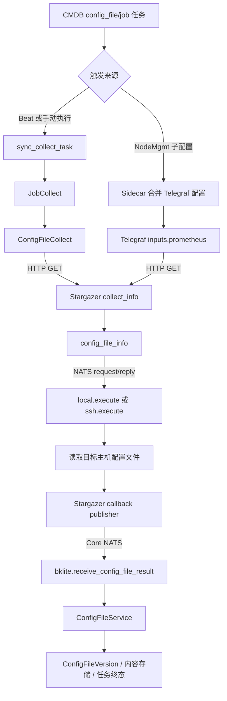
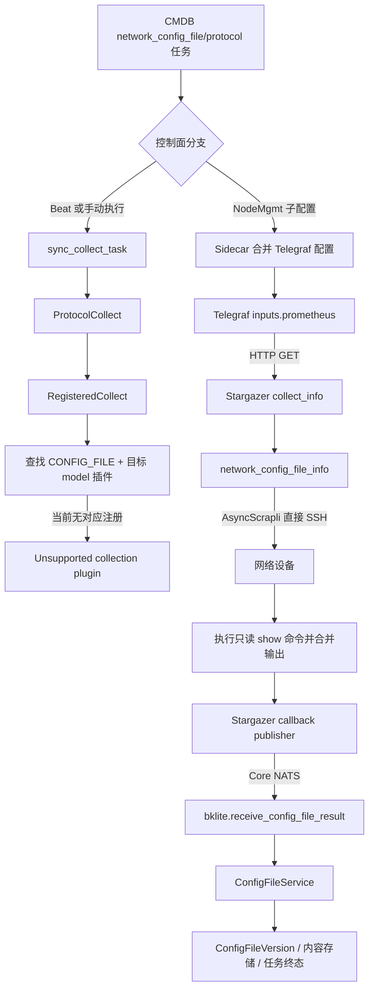

# 配置文件采集双插件链路与暂缓问题记录

Status: deferred（2026-09-01）

## 1. 记录目的

配置文件采集包含两个不同采集对象和插件：

- 主机配置文件：`model_id=config_file`、`driver_type=job`、Stargazer 插件
  `config_file_info`；
- 网络设备配置文件：`model_id=network_config_file`、`driver_type=protocol`、Stargazer 插件
  `network_config_file_info`。

两条链路并不对称。本记录固定当前代码事实、已发现缺陷和后续处理边界。本问题暂缓处理，不纳入
“成功数据唯一出站、凭据事件退出 NATS、160 弹性并发”本轮实施范围。

## 2. 共同控制面

创建或更新两个配置文件采集任务时，当前 Server 都会执行以下外部操作：

1. 周期任务注册按任务 Celery Beat：`sync_collect_task`；
2. 所有非 K8s 任务生成 NodeParams，通过 NATS RPC 调用 NodeMgmt；
3. NodeMgmt 保存 Telegraf ChildConfig；
4. Sidecar 拉取配置时合并 ChildConfig；
5. Telegraf 的 `inputs.prometheus` 按配置周期请求
   `${STARGAZER_URL}/api/collect/collect_info`。

节点管理只负责保存、渲染和分发 Telegraf 配置，不直接执行配置文件采集。NATS RPC 在这里属于
控制面；Telegraf 到 Stargazer 的触发协议是 HTTP。

## 3. 主机配置文件当前链路

主机配置文件存在两个实际 HTTP 触发来源：

- 当前 execution 的 Celery/手动链路直接调用 Stargazer；
- 节点配置中的 Telegraf 周期调用 Stargazer。

主机目标上的脚本不是 Stargazer 进程直接执行，而是 Stargazer 通过 NATS request/reply 请求对应
接入点的 `local.execute.<node>` 或 `ssh.execute.<node>` 执行。

## 4. 网络设备配置文件当前链路

网络配置文件的实际采集触发设计来自 Telegraf HTTP。Celery/手动链路不会进入
`ConfigFileCollect`，而是进入当前没有对应结果插件的 `ProtocolCollect` 分支。网络设备命令由
Stargazer 使用 AsyncScrapli 直接连接设备执行，不经过 nats-executor。

## 5. 已确认问题

### CF-1 主机配置文件存在双触发

周期任务同时拥有 Celery Beat 和 Telegraf 周期配置，二者都能调用 Stargazer HTTP 入口，可能产生
重复采集和重复 callback。

### CF-2 网络配置文件 Celery 分支错误

`sync_collect_task -> ProtocolCollect -> RegisteredCollect` 会按
`task_type=config_file + target model_id` 查找 CMDB collection plugin；当前没有相应注册，因此该分支
不能触发网络配置采集。

### CF-3 callback execution 身份与 Telegraf 周期不兼容

CMDB 的 `ConfigFileService` 只接受携带当前 `execution_id`、且任务仍处于 RUNNING 的 callback。
Telegraf ChildConfig 在任务创建/更新时生成，不能天然携带每一轮新生成的 execution ID：

- 主机 NodeParams 中的 `execution_id` 可能为空或已经过期；
- 网络 NodeParams 当前完全没有下发 `execution_id`。

因此 Telegraf 的独立周期与 CMDB 的“本轮执行”生命周期存在结构性冲突。

### CF-4 HTTP 接纳协议不一致

当前 Stargazer 返回 HTTP `202` 和 `X-Task-Status=accepted|duplicate_active`；Server 的
`ConfigFileCollect` 仍要求 HTTP `200` 和 `queued|skipped`，会把已经接纳的请求判为触发失败。

### CF-5 多目标身份不完整

- 主机 NodeParams 只有单目标时才下发 `target_instance_uuid`；
- 网络 NodeParams 可以下发多个 hosts，但目标 UUID、设备类型和实例名称取自第一个实例。

因此当前 Telegraf ChildConfig 不能正确表达多目标配置文件任务的逐目标 callback 身份。

### CF-6 非周期任务仍可能获得周期 Telegraf 配置

当前非 K8s 任务都会同步 NodeParams。即使任务没有注册 Beat，NodeParams 的 interval 仍会回退到
插件默认的 600 秒，使“仅手动”配置文件任务也可能被 Telegraf 周期触发。

## 6. 暂缓边界

本轮不修改：

- 两个配置文件插件的触发所有权；
- Celery Beat 与 Telegraf 的去重/取舍；
- 配置文件 callback 的 execution 协议；
- 网络配置文件的 protocol 分支；
- 配置文件多目标拆分和聚合；
- 配置文件内容存储与版本模型。

配置文件 callback 属于明确的低流量业务控制协议，暂时继续保留在 typed control NATS 中；不得把
它与普通 metrics 或凭据尝试事件合并统计，也不得以本记录为由删除 callback。

## 7. 后续恢复条件

恢复本问题时，应先做产品决策：配置文件采集由 CMDB execution 驱动，还是由 Telegraf 周期驱动。
只有确定唯一触发所有者后，才能统一 execution ID、手动/周期语义、多目标聚合和 callback 幂等，
并为两个插件分别建立端到端回归测试。
