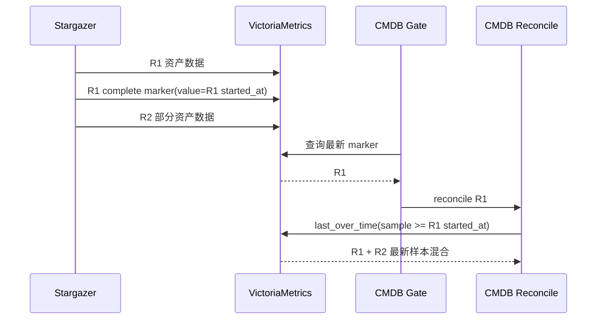
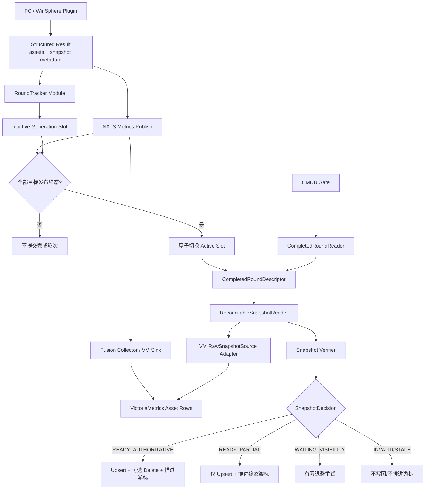
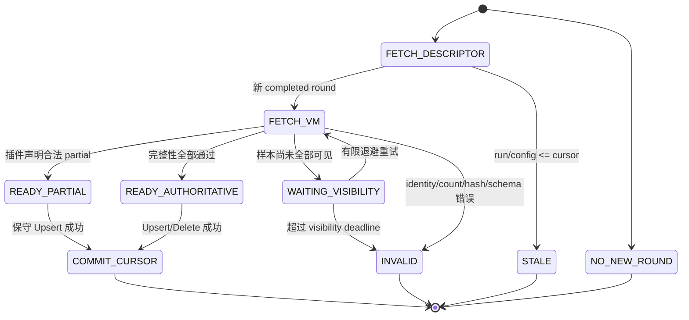

# Stargazer 配置采集轮次边界与有界快照实施方案

Status: draft-for-review

## 1. 文档定位

本文是在以下事实得到确认后，对现有 Phase 2 方案的修订：

- 从 VictoriaMetrics 标签移除每轮变化的 `collection_result_id`、fence、attempt 和
  snapshot 字段是正确方向；
- “查询窗口大于等于采集周期”只能提高召回率，不能证明查询结果属于某个已完成轮次；
- 当前 `last_over_time(...)[round_ts, now]` 只有下界，可能把下一轮尚未完成的数据混入本轮；
- instant query 响应中的 `value[0]` 是查询求值时间，不能作为被选中原始样本的可靠时间身份；
- 以 `(task, target, publish_timestamp)` 每轮创建 Redis key，会把按轮次增长从 VM 搬到 Redis；
- PC/WinSphere 的删除安全依赖完整快照，不能用扩大 PromQL 窗口替代轮次证明。

本文保留
[`metric-label-cardinality-phase-2-design.md`](metric-label-cardinality-phase-2-design.md)
中的标签治理目标，但替换其以下核心机制：

1. 不再由 VM 查询结果反推 Redis metadata key；
2. 不再把“每轮 timestamp key + 固定 24h TTL”作为最终存储模型；
3. 不再以 `sample_ts >= round_ts` 作为完整轮次边界；
4. 增加有界完成轮次描述符、精确样本选择、VM 可见性状态和单调游标。

在本文确认并实施前，旧 Phase 2 文档仍是探索稿，不应据此合并破坏性删除链路。

## 2. 决策摘要

### 2.1 核心决定

1. **采集周期只决定何时启动采集，不决定业务数据查询窗口。**
2. **Stargazer 控制面拥有完成轮次事实。** VM marker 是投影和兼容信号，不是精确轮次事实源。
3. **VM 只保存资产行。** 每轮身份、目标发布时间、完整性计数和 manifest 不进入 VM 标签。
4. **CMDB 先取得 `CompletedRoundDescriptor`，再按其中每个 target 的发布时间精确读取 VM。**
5. **完成轮次只保留两个 generation slot。** 容量随任务和目标数增长，不随历史轮次数增长。
6. **VM 已接收 NATS 消息不等于样本已可查询。** 完成描述符存在但数据尚不可见时返回
   `WAITING_VISIBILITY`，不写图、不推进游标。
7. **只有 `READY_AUTHORITATIVE` 允许差集删除。** partial、legacy、missing、conflict 和 visibility
   timeout 默认禁止删除。

### 2.2 一句话模型

```text
Schedule 决定“什么时候跑”
CompletedRoundDescriptor 决定“应该读取哪一轮”
TargetSnapshotWatermark 决定“VM 中精确读取哪些样本”
SnapshotDecision 决定“是否允许写入、删除和推进游标”
```

## 3. 领域术语

| 术语 | 定义 | 事实所有者 |
|---|---|---|
| `CollectionSchedule` | 任务的周期和触发策略，例如 1 分钟、8 小时 | CMDB 任务配置 |
| `CollectionRun` | 某任务、通道角色和配置版本的一次实际运行 | Stargazer 运行时 |
| `run_id` | 一次运行的控制面身份；不进入 VM label | Stargazer |
| `CompletedRoundDescriptor` | 已完成轮次的目标集合、开始/完成时间和目标 watermark | Stargazer Redis |
| `TargetSnapshotWatermark` | 一个目标本轮资产行共同使用的 `publish_timestamp_ms` | Stargazer 发布器 |
| `SnapshotDecision` | CMDB 对本轮作出的可执行判定 | CMDB SnapshotReader |
| `reconcile_cursor` | CMDB 已成功处理的完成轮次游标 | CMDB CollectModel |
| `authoritative` | 已证明快照完整，可执行差集删除 | 完整性校验结果 |
| `visibility` | 描述符对应的原始样本是否已在 VM 可查询 | CMDB VM Adapter |

以下身份必须分开，禁止复用同一个 `task_id` 字段表达不同语义：

| 字段 | 示例 | 用途 |
|---|---|---|
| `collect_task_id` | `321` | CMDB 稳定任务身份 |
| `request_task_id` | `req_<sha256>` | HTTP 请求租约/去重身份 |
| `run_id` | `run_<uuid>` | 一次采集运行身份，仅控制面使用 |
| `run_attempt_id` | `attempt_<uuid>` | 运行重试与 fencing，仅运行时使用 |

## 4. 核心不变量

### 4.1 基数不变量

```text
VM series ~= resources * metrics * bounded_states
VM series != resources * metrics * collection_runs

Redis live keys ~= tasks * roles * config_versions * targets * 2_slots
Redis live keys != tasks * targets * retained_collection_runs
```

`run_id`、attempt、fence、snapshot ID 和时间戳可以出现在控制面 value 中，但不得进入 VM 标签。

### 4.2 轮次不变量

1. 一个完成描述符严格绑定：

   ```text
   (collect_task_id, collection_role, channel_config_version, run_id)
   ```

2. 描述符只能在全部目标达到终态且发布步骤完成后提交为 `current`。
3. 每个目标的资产行共享一个稳定 `publish_timestamp_ms`，发布重试必须复用它。
4. CMDB 只接受与描述符 target 和 watermark 精确匹配的 VM 原始样本。
5. 下一轮的任何样本都不能满足上一轮的 watermark。
6. `reconcile_cursor` 只能单调前进；旧轮次、重复轮次和配置旧版本不得覆盖新游标。

### 4.3 删除不变量

只有同时满足以下条件才允许删除：

```text
descriptor.status == complete
AND target metadata schema valid
AND VM raw samples visible
AND target/model count valid
AND identity unique
AND manifest/hash valid（适用时）
AND CMDB upsert 无失败
```

任何条件未知都不等于 false，也不允许默认成 `0` 或空集合；未知必须 fail closed。

## 5. 当前链路及失效场景

### 5.1 当前链路



### 5.2 三类独立问题

| 问题 | 现象 | 为什么调大窗口无效 |
|---|---|---|
| marker 漏发现 | Gate/VM 故障超过 1h 后找不到已完成标记 | 需要恢复窗口或控制面 latest，不是业务数据窗口 |
| 下一轮穿透 | R1 对账读到 R2 部分数据 | 窗口越大越容易包含 R2 |
| metadata lookup 失败 | 用 instant query `value[0]` 拼 Redis key | `value[0]` 不是可靠原始样本时间 |

## 6. 目标架构



## 7. 深 Module 与 Interface

### 7.1 Stargazer `RoundTracker`

该 Module 隐藏 run identity、generation slot、Redis key、canonical 编码、CAS、TTL、容量限制和冲突语义。
发布器只学习两个操作：

```python
class RoundTracker:
    async def record_target(
        self,
        run: RunIdentity,
        target_result: PublishedTargetSnapshot,
    ) -> None: ...

    async def complete(
        self,
        run: RunIdentity,
        expected_targets: tuple[str, ...],
    ) -> CompletedRoundDescriptor: ...
```

Interface 约束：

- `RunIdentity.collect_task_id` 必须来自 `request.params["collect_task_id"]`；
- `request.task_id` 只能作为 `request_task_id`，不得冒充 CMDB 任务 ID；
- 同一 target 重试相同内容为幂等，不同内容为 conflict；
- `complete()` 必须校验 expected target 集合精确相等；
- Redis 暂时错误可有限重试；schema、大小和内容冲突为永久失败。

### 7.2 Server `ReconcilableSnapshotReader`

调用方不直接学习 NATS、Redis key、VM URL、PromQL、时间戳转换或 manifest 规则：

```python
class ReconcilableSnapshotReader:
    def load_latest(
        self,
        task: CollectTask,
        role: str,
        cursor: ReconcileCursor | None,
    ) -> SnapshotDecision: ...
```

返回值：

```python
class SnapshotDecisionStatus(StrEnum):
    NO_NEW_ROUND = "no_new_round"
    READY_AUTHORITATIVE = "ready_authoritative"
    READY_PARTIAL = "ready_partial"
    WAITING_VISIBILITY = "waiting_visibility"
    INVALID = "invalid"
    STALE = "stale"
    LEGACY_UPSERT_ONLY = "legacy_upsert_only"
```

`SnapshotDecision` 至少包含：

```text
status
run_id
started_at_ms
completed_at_ms
rows_by_model
authoritative_models
deletion_allowed
cursor_to_commit
stable_error_code
```

外部调用方只按 `status` 执行动作，不自行拼查询或重复完整性判断。

### 7.3 Adapter

| Seam | 生产 Adapter | 测试 Adapter |
|---|---|---|
| 完成轮次读取 | Stargazer NATS request/reply | In-memory CompletedRoundReader |
| VM 原始样本读取 | VictoriaMetrics RawSnapshotSource | Fixture/In-memory SnapshotSource |
| 控制面存储 | Redis Generation Store | In-memory Generation Store |

生产与测试 Adapter 共享相同 Interface；测试应通过 Module Interface 验证结果，不越过 Interface 断言 Redis key。

## 8. CompletedRoundDescriptor 协议

### 8.1 Envelope

```yaml
schema_version: 2
kind: completed_inventory_round
collect_task_id: "321"
instance_id: "cmdb_321"
collection_role: device
channel_config_version: "7"
model_id: pc
run_id: run_01J...
request_task_id: req_abc...       # 可选，仅诊断
started_at_ms: 1780000000000
completed_at_ms: 1780000123456
status: complete                  # complete | partial
expected_targets: 2
targets:
  - collection_target: 10.0.0.8
    collection_plugin_ref: pc.config
    publish_timestamp_ms: 1780000060123
    snapshot_id: snapshot-1
    snapshot_status: complete
    details:
      software_expected_count: 42
      software_error_count: 0
  - collection_target: 10.0.0.9
    collection_plugin_ref: pc.config
    publish_timestamp_ms: 1780000100456
    snapshot_id: snapshot-2
    snapshot_status: partial
    details:
      software_expected_count: 40
      software_error_count: 1
```

### 8.2 Schema 规则

- `collect_task_id`、role、config version、model、run ID 和 target 非空且有长度上限；
- `started_at_ms <= publish_timestamp_ms <= completed_at_ms`；
- target 唯一，target 数量等于 `expected_targets`；
- PC `software_expected_count`、`software_error_count` 必填、为非负整数；
- WinSphere manifest 必须通过固定八模型 schema 校验；
- `complete` 不允许缺少 target metadata；
- 错误正文、凭据、资产 payload 和外部响应正文不得进入 descriptor；
- canonical JSON 和 digest 用于幂等比较，但 caller 不接触 digest 实现。

## 9. Redis 有界 Generation 设计

### 9.1 Key 结构

```text
stargazer:collection:v2:round:<task>:<role>:<config>:active
stargazer:collection:v2:round:<task>:<role>:<config>:slot:a:descriptor
stargazer:collection:v2:round:<task>:<role>:<config>:slot:a:target:<target_sha256>
stargazer:collection:v2:round:<task>:<role>:<config>:slot:b:descriptor
stargazer:collection:v2:round:<task>:<role>:<config>:slot:b:target:<target_sha256>
```

`active` 指向 `a` 或 `b`。新运行写 inactive slot；完整校验后用 Lua/CAS 原子切换 active。

### 9.2 为什么只保留两个 slot

当前 CMDB 采集语义是全量状态对账，Gate 本身只消费“最新完成轮次”，不承诺逐轮审计。因此允许合并中间完成轮次：

```text
R1 未消费，R2/R3 已完成 → CMDB 可直接消费最新 R3
```

两个 slot 用于保证写新轮时当前完成轮仍可读取。NATS handler 必须在一次原子读取中返回 descriptor
及 target metadata，避免读取过程中 slot 被下一轮复用。

如果未来业务要求每轮审计或逐轮回放，必须改用 durable run ledger；不得通过无限增加 slot 或 TTL 实现。

### 9.3 TTL

TTL 不固定为 24 小时，按任务恢复预算计算：

```text
slot_ttl = max(
    MIN_SLOT_TTL,
    2 * collection_interval
      + max_run_duration
      + gate_outage_budget
      + safety_buffer,
)
```

建议初始值：

```text
MIN_SLOT_TTL = 24h
gate_outage_budget = 24h
safety_buffer = 1h
```

40 小时周期会得到大于 80 小时的 TTL，不会因为固定 24 小时在下一轮前丢失控制事实。任务删除时运行期幂等清理，TTL 作为泄漏兜底。

## 10. NATS Interface

### 10.1 请求

```yaml
method: get_latest_completed_round
schema_version: 2
caller: cmdb-server
organization: Default
collect_task_id: "321"
instance_id: "cmdb_321"
collection_role: device
channel_config_version: "7"
after_run_id: run_01J...          # 可空
```

### 10.2 响应

```yaml
success: true
schema_version: 2
status: ready                    # ready | no_new_round
descriptor: {...}
```

约束：

- handler 校验可信 caller、organization 和任务 scope；
- 只返回 active completed generation，不支持扫描、前缀和任意 run ID 枚举；
- descriptor 及 target metadata 在一次原子读取中组装；
- 返回固定错误码，不返回 `str(exception)`：

  ```text
  invalid_request
  forbidden
  metadata_unavailable
  metadata_conflict
  unsupported_schema
  response_too_large
  ```

- RPC 超时保持 3 秒；CMDB 周期补偿，不在单次 RPC 内无限重试。

## 11. VictoriaMetrics 查询设计

### 11.1 URL 判断

当前 `/prometheus/api/v1/query` 适合即时指标求值，不适合作为配置快照的原始样本身份来源。
PC/WinSphere 精确快照读取优先新增 `RawSnapshotSource` Adapter，使用 VictoriaMetrics 原始导出能力：

```text
POST <vm-base>/api/v1/export
```

部署形态存在单机/集群路径差异，最终 URL 只能由 Adapter 基于现有 `VICTORIAMETRICS_HOST` 生成，调用方不得拼 URL。

请求必须包含：

```text
match[] = metric selector + instance_id + collection_target
start   = publish_timestamp_ms - clock_epsilon
end     = publish_timestamp_ms + clock_epsilon
```

读取后按原始样本时间严格过滤：

```text
raw_sample_timestamp_ms == descriptor.publish_timestamp_ms
```

### 11.2 为什么不采用 query_range

Prometheus range query 返回的是每个 step 的表达式求值结果；它不能天然证明返回时间就是原始样本时间。
因此 `query_range` 可以用于趋势，不作为本方案的快照身份依据。

### 11.3 兼容备选

若部署环境暂不允许 export endpoint，可在 `/prometheus/api/v1/query` Adapter 内组合：

```text
last_over_time(selector[visibility_window])
and
(tlast_over_time(selector[visibility_window]) == <publish_timestamp_seconds>)
```

并显式传递求值 `time`。上线前必须用目标 VM 版本做协议 smoke test；仍禁止直接使用响应 `value[0]`
作为 metadata key。

### 11.4 查询批量与容量

- PC/WinSphere 每个 target 内所有行共享 timestamp，按 target 批量读取；
- 单批设置 target 数、返回行数、响应字节和 deadline 上限；
- 超限拆批，不把完整任务资产一次加载到无界内存；
- 相同 target/timestamp 出现重复资源身份时判为 `INVALID`；
- 没有任何行不能直接解释成权威空快照，必须结合 descriptor count/manifest。

## 12. 时间与各种采集周期

### 12.1 时间职责

| 时间 | 用途 | 禁止用途 |
|---|---|---|
| `collection_interval` | 调度、TTL 恢复预算、健康度 | 决定快照查询边界 |
| `started_at_ms` | 运行诊断、时序合法性校验 | 单独证明轮次完整 |
| `completed_at_ms` | 完成事实、可见性 deadline | 代替每目标发布时间 |
| `publish_timestamp_ms` | 精确选择目标资产行 | 作为 VM label |
| `gate_interval` | 发现延迟上界 | 轮次身份 |

### 12.2 场景矩阵

| 场景 | 行为 |
|---|---|
| 1 分钟周期、Gate 5 分钟 | Gate 读取最新完成 generation；中间轮次允许合并，不串入下一轮 partial |
| 8 小时周期、正常 Gate | 完成后最近一次 Gate 消费，不需要 8 小时业务查询窗口 |
| 8 小时周期、Gate 停摆 2 小时 | current descriptor 仍可读，不受 marker `[1h]` 限制 |
| 40 小时周期 | TTL 按周期计算，不能固定 24 小时 |
| 运行时长超过周期 | 同一任务 lease 阻止并发；若允许并发则不同 generation 仍隔离 |
| 下一轮已开始但未完成 | active 仍指向上一完整轮；staging 不可见 |
| VM 写入延迟 | `WAITING_VISIBILITY`，有限重试，不推进游标 |
| 任务修改配置版本 | 新旧 config version 使用独立 scope；旧版本轮次不能覆盖新游标 |
| 任务暂停/删除 | current 保留到恢复预算；删除后运行期清理 |

## 13. CMDB 状态机



游标建议保存：

```yaml
reconcile_cursors:
  device:
    channel_config_version: "7"
    run_id: run_01J...
    completed_at_ms: 1780000123456
```

兼容读取旧 `last_synced_round`，但新写入使用组合游标。判断必须是单调比较，不再只判断相等。

## 14. PC 与 WinSphere 规则

### 14.1 PC

Stargazer 插件必须直接输出：

```python
StructuredMetricsPayload(
    data={"pc": [...], "pc_software": [...]},
    round_metadata={
        "snapshot_id": ...,
        "snapshot_status": ...,
        "details": {
            "software_expected_count": ...,
            "software_error_count": ...,
        },
    },
)
```

禁止由 `CollectionService` 同时猜测顶层字段和剥离行内字段。真实 PC 插件合同测试必须覆盖完整返回路径。

PC complete 校验：

1. 每 target 恰好一个 PC 根对象；
2. 软件全部归属该 PC；
3. `inst_name` 和 `software_key` 均唯一；
4. expected/error count 必填且为非负整数；
5. 实际数量等于 expected count；
6. error count 为零；
7. 空软件清单只有在 `expected_count == 0` 明确出现时才是权威空快照。

### 14.2 WinSphere

真实插件必须生成 snapshot metadata 和固定八模型 manifest。验证：

1. 顶层 snapshot ID 与 manifest 一致；
2. 精确包含固定八模型；
3. 每模型 resource ID 唯一；
4. 实际 count 与 manifest 一致；
5. identity hash 一致；
6. `authoritative` 必须是布尔值；
7. 每个 target 的八模型使用同一 watermark；
8. 只有验证通过的模型进入 `authoritative_models`。

## 15. 发布与可见性顺序

### 15.1 Stargazer

```text
1. 生成稳定 run_id
2. 插件返回 assets + metadata
3. 为目标分配一次 publish_timestamp_ms
4. RoundTracker.record_target 写 inactive slot
5. 发布 VM 行并等待现有 NATS publish/flush
6. 全部目标终态后 RoundTracker.complete
7. CAS 切换 active generation
8. 发布兼容 cmdb_round_complete marker
```

第 5 步只证明消息已被 NATS 接收，不证明 VM 已可查询；因此第 7 步表示 transport complete，
最终 visibility 由 CMDB Reader 验证。

### 15.2 CMDB

```text
1. Gate 调用 CompletedRoundReader
2. 无新 generation → 跳过
3. 读取 descriptor 并校验 scope/schema
4. 按 target watermark 查询 VM 原始样本
5. 不可见 → 有限退避；仍不可见则本轮失败
6. 完整性验证
7. 产生 SnapshotDecision
8. 根据 decision 执行图写入
9. 全部副作用成功后提交组合游标
```

## 16. 兼容策略

### 16.1 新 Server + 旧 Stargazer

- 没有 v2 descriptor 时进入 `LEGACY_UPSERT_ONLY`；
- marker recovery window 至少使用任务周期、最大运行时长和恢复预算计算；
- legacy 模式不得执行 destructive delete；
- 不把 legacy 查询结果写成 v2 authoritative cursor。

### 16.2 旧 Server + 新 Stargazer

PC/WinSphere snapshot 标签已移除后，旧 Server 无法证明完整性。采用暂停任务后的硬切换，不支持该组合长期运行。

### 16.3 手动执行

拆成两个显式语义：

- `立即采集并对账`：等待本次 run 的 completed descriptor，只消费该轮；
- `按现有缓存对账`：允许读取缓存，但强制 upsert-only，不允许删除。

禁止继续用一个“手动直通”同时表达这两种不同安全级别。

## 17. 失败语义

| 失败 | 决策 | 游标 | 删除 |
|---|---|---|---|
| Redis 暂时不可用 | 发布有限重试，耗尽后本轮失败 | 不变 | 禁止 |
| generation conflict | `INVALID`，稳定错误码 | 不变 | 禁止 |
| NATS metadata timeout | 本轮失败，周期补偿 | 不变 | 禁止 |
| VM 尚不可见 | `WAITING_VISIBILITY` | 不变 | 禁止 |
| visibility timeout | `INVALID` | 不变 | 禁止 |
| PC count 缺失/非法 | `INVALID` | 不变 | 禁止 |
| PC 合法 partial | `READY_PARTIAL` | 成功 Upsert 后推进 | 禁止 |
| WinSphere 某模型非权威 | 其他模型按验证结果处理 | 成功后推进 | 仅该模型禁止 |
| 下一轮 staging 中 | 继续读取 active completed round | 按 active | 不受 staging 影响 |
| 旧轮或旧配置版本 | `STALE` | 不变 | 禁止 |

生产日志只记录稳定 event、task、role、config version、run ID、有界 target 摘要、failed stage、
error type/code；不得记录 metadata details、manifest、资产 payload、凭据和异常响应正文。

## 18. 分阶段实施

### 阶段 0：先封住当前 WIP 风险

1. 修正 metadata 的 `collect_task_id` 来源；
2. PC/WinSphere 真实插件直接返回 `round_metadata`；
3. complete metadata 强制校验 model-specific schema；
4. NATS handler 增加 caller/org 校验和固定错误码；
5. Redis 暂时错误映射为可重试 outcome；
6. 在 v2 完成前禁止 PC/WinSphere 新链路 destructive delete。

### 阶段 1：实现 v2 RoundTracker

1. 定义 v2 descriptor、RunIdentity 和 TargetSnapshot；
2. 实现双 slot Redis Generation Store；
3. 实现原子 complete/read；
4. TTL 改为周期和恢复预算派生；
5. 删除 v1 timestamp-per-run key 新写入路径。

### 阶段 2：实现 CompletedRoundReader

1. 新增 `get_latest_completed_round` NATS method；
2. Server Adapter 路由到目标区域 Stargazer；
3. 校验 scope、schema、响应大小和 config version；
4. 定义组合游标及单调比较；
5. Gate 优先读取 v2 descriptor。

### 阶段 3：实现 RawSnapshotSource

1. 对目标 VM 环境验证 export URL、租户路径和时间精度；
2. 实现原始样本读取与精确 timestamp 过滤；
3. 加入批量、字节、行数、deadline 和重试上限；
4. 明确区分 empty authoritative 与 visibility missing；
5. 删除 PC/WinSphere 对 instant query `value[0]` 的身份依赖。

### 阶段 4：实现 ReconcilableSnapshotReader

1. 组合 descriptor、VM rows 和 model verifier；
2. 统一返回 SnapshotDecision；
3. PC/WinSphere 调用方只按 decision 执行；
4. 图副作用前完成所有 target 校验；
5. 成功后提交组合游标。

### 阶段 5：Gate 与 legacy 收口

1. v2 任务不再依赖固定 `[1h]` marker 查询；
2. legacy marker window 按周期和恢复预算派生；
3. `round_ts <= cursor` 全部视为 stale；
4. 手动执行拆成精确采集和缓存对账两个语义；
5. 观察稳定后移除 PC/WinSphere v1 metadata reader。

## 19. 计划修改面

| 文件/目录 | 计划 |
|---|---|
| `agents/stargazer/core/collection/contracts.py` | 增加 v2 RunIdentity、TargetSnapshot、Descriptor 数据合同 |
| `agents/stargazer/core/collection/round_metadata.py` | 替换为 Generation Store 和 RoundTracker 深 Module |
| `agents/stargazer/core/collection/result_publisher.py` | 使用稳定 collect task identity，记录 target 后完成 generation |
| `agents/stargazer/core/collection/executor.py` | 创建并贯穿稳定 run identity |
| `agents/stargazer/service/nats_server.py` | v2 latest completed handler、scope 和错误映射 |
| PC/WinSphere Enterprise plugins | 真实输出 assets + metadata，不依赖 Service 猜测 |
| `server/apps/cmdb/collection/round_metadata.py` | 改为 CompletedRoundReader Adapter |
| `server/apps/cmdb/collection/query_vm.py` | 保留 legacy；新增 RawSnapshotSource，不复用 instant 解析语义 |
| `server/apps/cmdb/collection/round_sync.py` | v2 descriptor gate、组合游标、stale 判断 |
| `server/apps/cmdb/services/pc_discovery.py` | 严格 schema，不把缺失 count 转零 |
| WinSphere Enterprise collect Adapter | 消费 descriptor，输出 authoritative model 集合 |
| `server/apps/cmdb/tasks/celery_tasks.py` | 根据 SnapshotDecision 派发/提交游标 |

若实际实现改变 CMDB 模块职责、核心数据流或跨模块 Interface，应同步更新 CMDB 架构报告及对应 Archify JSON；
单纯局部 Adapter 修复不扩张架构产物。

## 20. 测试矩阵

### 20.1 Stargazer

- request task ID 与 collect task ID 不同，descriptor 必须使用后者；
- 同 target 同 timestamp 重试相同内容幂等，不同内容 conflict；
- inactive slot 写失败不影响 active；
- complete 前 active 不变化；
- target 缺失/重复时不能 complete；
- Redis 暂时故障重试后成功；
- PC/WinSphere 真实插件输出不包含 snapshot VM 标签；
- PC complete 缺 count/非法 count 被拒绝；
- 两轮、百轮运行后 live key 数保持有界；
- handler 跨 caller/org 请求被拒绝；
- 错误响应和日志无异常正文/payload/凭据。

### 20.2 Server

- 1 分钟周期、Gate 5 分钟时只消费最新 completed generation；
- R1 已完成、R2 部分写入时，R1 查询不包含 R2；
- 8 小时周期且 Gate 停摆 2 小时后仍能发现 R1；
- 40 小时周期 metadata 不因 24h TTL 提前丢失；
- descriptor 存在但 VM 未可见时返回 waiting，不判权威空；
- VM 延迟后重试可转 ready；
- visibility timeout 不写图、不推进游标；
- PC 空软件必须有显式 expected=0 才允许删除；
- WinSphere 八模型 count/hash/authoritative 校验；
- 旧 run、重复 run、旧 config version 不回退游标；
- partial 只 Upsert；authoritative 才 Delete；
- 手动精确采集与缓存对账具有不同删除权限。

### 20.3 VM 协议与容量

- 目标环境 export endpoint URL 和租户路径 smoke test；
- 毫秒 timestamp 能精确还原；
- 同资源历史 label 变体不进入目标 snapshot；
- 超行数、超字节、超 deadline 时有界失败；
- 多 target 拆批不跨 target 混合；
- 连续采集后 VM series 不随 snapshot/run identity 增长；
- Redis live keys 在固定任务/目标数下保持稳定。

## 21. 上线与回滚

### 21.1 上线

1. 暂停 PC/WinSphere 周期任务；
2. 部署包含 v2 reader 但尚未启用删除的 Server；
3. 部署 Stargazer v2 RoundTracker 和真实插件合同；
4. 每个区域执行 NATS caller/org、descriptor 和 VM raw query smoke test；
5. 新建测试任务验证 complete、partial、empty、VM 延迟和 Redis 故障；
6. 连续运行至少两个周期，确认 VM series 和 Redis live key 有界；
7. 启用 authoritative delete；
8. 恢复周期任务并观察至少两个最长业务周期。

### 21.2 回滚

1. 暂停任务；
2. 先关闭 destructive delete；
3. 同时回滚 Server/Stargazer，避免旧消费者读取无 snapshot 标签数据；
4. Redis v2 slot 由 TTL/运行期清理回收，不扫描全库删除；
5. VM 和 CMDB 资产不做破坏性清理；
6. 旧链路仅作为短期恢复，会重新产生 snapshot 动态 series。

## 22. 验收标准

全部满足才可宣告完成：

1. VM 标签不再包含 run、attempt、fence、snapshot ID、snapshot status、count 和 manifest；
2. 连续多轮仅控制信息变化时，VM series key 稳定；
3. Redis live key 数不随已完成轮次数增长；
4. 1 分钟、8 小时、40 小时周期均通过场景测试；
5. R1 对账不能读取 R2 未完成数据；
6. instant query `value[0]` 不再用于构造快照身份；
7. PC/WinSphere 真实插件到 CMDB 的合同测试闭环；
8. descriptor/VM 任一侧缺失都不允许删除或推进游标；
9. 合法 partial 可保守 Upsert，权威 complete 可安全删除；
10. caller/org、错误码、日志和 payload 满足安全约束；
11. Server、Stargazer、Enterprise 定向测试与 lint 全绿；
12. 灰度环境证明 VM series 与 Redis keys 均符合容量公式。

## 23. 待确认决策

1. 接受“全量配置快照只消费最新完成轮次，中间完成轮次可合并”的语义；
2. 接受双 generation slot，而不是 timestamp-per-run key；
3. 优先采用 VM raw export；若目标环境不可用，才采用 `tlast_over_time` 兼容 Adapter；
4. legacy 数据一律 upsert-only，不允许 destructive delete；
5. 手动执行拆成“立即采集并精确对账”与“缓存保守对账”；
6. v2 组合游标按 `(task, role, config_version, run_id/completed_at)` 单调推进；
7. TTL 按采集周期和恢复预算派生，不固定为 24 小时。

## 24. 拒绝的方案

| 方案 | 结论 | 原因 |
|---|---|---|
| 查询窗口固定为采集周期 | 拒绝 | 只有时间范围，没有完成轮次上界，仍会串轮 |
| 所有查询窗口统一放大 | 拒绝 | 增加历史 series 和下一轮样本混入概率 |
| 继续从 VM `value[0]` 定位 Redis key | 拒绝 | instant query 求值时间不是可靠原始样本身份 |
| 每轮一个 Redis timestamp key | 拒绝 | live key 随 `TTL / interval` 增长，只是转移基数问题 |
| 把 run/snapshot ID 放回 VM label | 拒绝 | 恢复按轮次 series churn |
| 只依赖 NATS publish/flush 作为 VM 可见证明 | 拒绝 | 无法证明下游 sink 已完成持久化和可查询 |
| metadata 缺失时默认 count=0 | 拒绝 | 会把未知误判为权威空快照，存在误删风险 |
| 为保留全部历史不断增加 generation slot | 拒绝 | 与全量最新状态语义不符；逐轮审计应使用 durable ledger |
