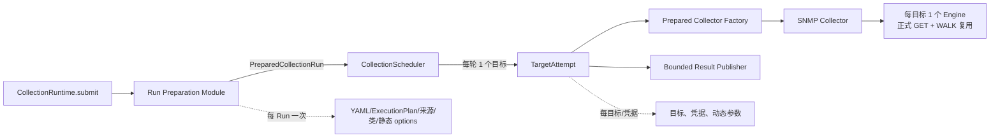

# Stargazer 大规模 SNMP 配置采集链路优化实施方案

Status: approved；阶段 A-C 已实现，调度量子经压测固定为 `1`
Date: 2026-08-27
Scope: `agents/stargazer` 的配置采集运行时、全局目标调度器和 `network/snmp_facts`

## 1. 决策摘要

面向单次约 3000 台网络设备、多 Run 同时触发的配置采集，采用以下方案：

1. 保留单 Pod 最大目标并发上限；上线初始值按压测证据使用 `200`，不直接以 `250` 作为生产目标。
2. 全局调度器固定采用 `quantum=1` 的“小批次轮询”：每个事件循环轮次只创建一个目标 Task，随后在锁外 `await asyncio.sleep(0)` 主动让出事件循环。`1/2/4/8` 对照压测已完成，较大量子没有稳定吞吐收益且会放大超时长尾，结果见 `snmp-scheduler-quantum-load-test-report-2026-08-27.md`。
3. 调度等待时间不计入单阶段采集超时；分别观测排队、探测、正式采集和发布耗时，不把排队误报为 `plugin_timeout`。
4. SNMP 内部 PDU 超时维持 `10s`、`retries=1`，不改动；外层探测预算调整为 `25s`，正式采集预算默认维持 `60s`，SNMP 最小有效值调整为 `30s`。
5. 把 YAML 解析、执行器解析、插件来源选择、Collector 类加载和静态 options 从“每目标/每阶段”提升到“每 Run 一次”；目标阶段只合并目标与凭据动态参数。
6. 正式 SNMP 采集先把“系统 GET + 接口 WALK”使用的多个 `SnmpEngine` 收敛为每目标一个，并在 `finally` 关闭；暂不直接引入跨目标共享 Engine。
7. 先用指标证明是否存在“任务在后续 await 点再次同时汇聚”的第二次启动洪峰；只有证据成立，才增加内部 `CollectionStartPacer`，不预先增加第二套容量配置。

该方案优先解决事件循环响应性和超时准确性，不承诺凭空增加 CPU 吞吐。`250` 并发已经压满 CPU，因此即使调度更平滑，也必须重新压测后才能恢复到 `250`。

## 2. 背景与证据

### 2.1 客户场景

- 客户需要批量采集约 3000 台网络设备；
- 多个配置采集 Run 可能在同一分钟触发；
- 当前单 Pod 配置为 `MAX_ACTIVE_TARGETS=250`、`TARGET_TASK_WINDOW=250`；
- 已有压测显示：`200` 并发未吃满 CPU，`250` 并发吃满 CPU，存在明显容量拐点。

### 2.2 日志现象

本次 `stargazer.log` 中，03:00 左右同时进入 5 个 Run，共 4100 个目标，其中 4090 个为 SNMP 网络设备：

- `cmdb_26`：2046 台；
- `cmdb_27`：1022 台；
- `cmdb_25`：1022 台；
- 另有 9 台 host 和 1 个 VMware 目标。

日志可见：

- 495 个 `target_collection_failed`，错误均为 `plugin_timeout`；
- 126 个 `pysnmp.carrier.error.CarrierError: Unable to call cbFun`；
- 第一批约 240 个 SNMP 目标集中在约 66 秒后失败，虽然外层日志显示 `timeout_seconds=10.0`；
- 第二批失败耗时约 25 秒；
- SNMP `collection_started` 日志在约 65 秒内陆续出现，而不是快速进入网络等待。

这说明超时并非简单的“槽位不够、慢慢消费”。事件循环长时间执行同步初始化，导致网络 I/O、取消和已经登记的超时回调不能按时运行。

### 2.3 代码证据

当前全局调度器在一次持有 `asyncio.Condition` 的事件循环轮次中，通过
`while self._has_dispatchable_run()` 持续创建 Task，直到一次灌满全部空槽：

- `agents/stargazer/core/collection/scheduler.py:134-174`

当前实际容量取两个非零值的较小者：

- `agents/stargazer/core/collection/application.py:185-199`

正式采集外层超时只包围 `plugin.collect()`：

- `agents/stargazer/core/collection/credential_attempt.py:398-426`

SNMP 内部固定超时和重试为：

- `agents/stargazer/plugins/inputs/network/snmp_facts.py:95-96`
- `timeout=10s`，`retries=1`，单个无响应 PDU 理论上需要约 20 秒才能完成首次发送与一次重试。

SNMP 当前在事件循环中同步构造 `SnmpEngine()`，正式采集的系统 GET 和接口 WALK 还分别创建 Engine：

- `agents/stargazer/plugins/inputs/network/snmp_facts.py:179`
- `agents/stargazer/plugins/inputs/network/snmp_facts.py:239`
- `agents/stargazer/plugins/inputs/network/snmp_facts.py:348`

配置采集虽然已经在 Run 入口解析一次运行时插件和 `ExecutionPlan`，但
`CollectionService.collect()` / `probe()` 仍会为每个目标重复解析执行器配置；
`PluginExecutor` 还会为每次 probe/collect 重复定位 Collector 类并构造实例：

- `agents/stargazer/service/collection_service.py:84-129`
- `agents/stargazer/service/collection_service.py:207-225`
- `agents/stargazer/core/plugin/executor.py:75-91`

## 3. 根因模型

### 3.1 当前链路


`asyncio.create_task()` 只把任务放入 ready queue，不会立即把同步初始化并行化。事件循环仍是单线程；如果 250 个任务在第一次真正 `await` 前各执行一段同步工作，这些工作可能连续占用事件循环。

### 3.2 为什么 10 秒超时会在 66 秒后才记录

`asyncio.timeout()` 是协作式超时：到点后需要事件循环运行取消回调。它不是独立的抢占式计时器。

```text
t=0s       某目标登记外层 10s 超时
t=0~65s    事件循环连续处理大量同步初始化/ready task
t=10s      超时已到期，但回调没有执行机会
t≈65s      事件循环重新处理定时器，目标才收到取消并记为 timeout
```

因此观察到的 66 秒不是“外层超时从排队时开始计算”，而是“外层已经开始计时，但到点后无法及时执行”。

### 3.3 等待槽位是否计入超时

不计入当前 `collection_timeout`。

```text
Run 调度排队 ──不计入 collection_timeout──> 获得目标槽位
  -> preflight 独立预算
  -> access probe 独立预算
  -> plugin.collect 独立预算（collection_timeout）
  -> publish 独立预算
```

如果产品需要限制整轮墙钟时间，应使用独立 `Run deadline`，不能把调度等待混入 `plugin_timeout`，否则 CPU 拥塞会被误诊为设备采集超时。

## 4. 目标与非目标

### 4.1 目标

1. 3000 台目标流式、有界消费，不为全部目标一次性创建 Task；
2. 多 Run 公平轮询，新来的小 Run 能快速获得下一空闲槽位；
3. 单 Pod 最大在途并发仍可达到配置上限，但以平滑方式升高；
4. 事件循环不再被“容量 × 每目标同步切片”连续占用；
5. SNMP 内部 `10s + 1 retry` 语义保持不变，外层预算允许其完整执行；
6. 静态加载只做一次，目标热路径只承担目标相关工作；
7. 保持现有结果顺序、失败隔离、拓扑借槽、发布和关闭语义。

### 4.2 非目标

- 不把最大并发从 250 降为 1；
- 不新增持久任务队列或第二套运行时；
- 不让调度器感知 SNMP 业务细节；
- 不用延长超时掩盖事件循环阻塞；
- 第一阶段不启用跨目标共享 `SnmpEngine`；
- 第一阶段不把 GETNEXT 改为 GETBULK，避免兼容性变化与本次问题混在一起；
- 不新增 `SCHEDULER_DISPATCH_BATCH` 环境变量；调度量子通过受控压测选定并固化在代码中，不交给部署现场任意调大。

## 5. 目标架构与模块职责

外部 Interface 继续保持 `CollectionRuntime.submit(request)`，调用方不需要理解调度量子、加载缓存或 SNMP Engine 生命周期。优化集中在运行时内部 Seam，避免把内部细节扩散到 HTTP 入口和插件调用方。



### 5.1 Run Preparation Module

该 Module 在一个 Run 开始时完成：

1. 请求规范化和 `apply_yaml_target_policy`；
2. 解析 `ExecutionPlan`；
3. 解析最终 OSS/Enterprise 执行器来源和 fallback；
4. 导入并校验 Collector 类；
5. 冻结 `collector.options`、执行模式和 capacity group；
6. 产出不可变 `PreparedCollectionRun`。

概念 Interface：

```python
prepared = run_preparer.prepare(request)
collector = await prepared.create_collector(target_params)
```

`create_collector()` 只负责目标动态参数的安全复制和实例构造，不再读取 YAML、决定来源或重复 import。Collector 构造继续在事件循环外执行，直到对应构造器被证明足够轻量且非阻塞。

该 Module 隐藏复杂实现，为调用方提供一个小 Interface；测试从该 Seam 验证“一个 Run 只解析一次、不同目标参数不互相污染、Enterprise fallback 不变”。

### 5.2 CollectionScheduler

调度器只负责：

- 全局目标容量；
- Run 间 round-robin；
- workload 配额与拓扑借槽；
- Task 生命周期、取消和关闭；
- 每次事件循环轮次最多创建一个目标 Task。

它不负责 YAML、凭据、SNMP、超时和发布业务语义。

### 5.3 SNMP Collector

SNMP Collector 继续拥有协议细节：

- `timeout=10`、`retries=1`；
- auth、transport、GET/WALK；
- Engine 的创建、复用和关闭；
- 协议错误到稳定采集结果的转换。

通用运行时不增加通用 Driver/Session 基类。SNMP Engine 生命周期先在 SNMP Module 内收敛；只有两个以上协议出现相同真实需求时，才考虑抽取新 Seam。

## 6. 小批次轮询详细设计

### 6.1 算法

最终量子：

```python
_DISPATCH_QUANTUM = 1
```

`1` 已通过“固定250槽位、瞬时积压6000目标、单目标30秒”的 `quantum=1/2/4/8`
同代码、同机器对照压测定标。量子2/4的总周期收益均不足1%，量子8的 timeout
overshoot P99 达1.53秒并违反 `<1s` 门槛，因此不再把最终值保留为待定项。
当 `quantum > 1` 时，一个批次内仍须逐个轮询不同 Run，不能从同一个大 Run 连续取满整个批次；批次结束后统一在锁外让出事件循环。

最终选择规则：

1. 先淘汰 event-loop lag P99 `>=500ms`、timeout overshoot P99 `>=1s`、公平性不达标或出现 callback/孤儿 Task 的候选；
2. 在剩余候选中比较 3000 台总完成时间、目标吞吐和 CPU；
3. 如果较大 quantum 相比 `1` 的吞吐提升不足 3%，保留 `1`，优先响应性与确定性；
4. 只有吞吐有稳定、可重复的明显提升，且所有延迟与公平性门槛都通过，才选择 `2`、`4` 或 `8`；
5. 最终值写回内部常量并记录压测报告，不提供环境变量。

概念流程：

```python
async def _dispatch_loop(self) -> None:
    while True:
        task_created = False
        async with self._condition:
            await self._condition.wait_for(
                lambda: self._closing or self._has_dispatchable_run()
            )
            if self._closing:
                return

            run_id = self._take_next_dispatchable_run()
            if run_id is not None:
                # 在同一把锁内完成：
                # 1. 消费一个 item
                # 2. 预留 active/workload 槽位
                # 3. 写入结果占位
                # 4. create_task 并加入 state.tasks
                # 5. 将未耗尽 Run append 到队尾
                task_created = True

        if task_created:
            await asyncio.sleep(0)
```

初始 `quantum=1` 时，一个事件循环轮次最多创建一个新目标 Task。后续候选值大于 1 时，
按相同临界区规则最多创建选定 quantum 个 Task，然后必须在锁外让出事件循环。

### 6.2 必须保持的并发不变量

消费 item、预留槽位、结果占位、创建 Task、登记 `state.tasks` 和 Run 重新入队必须位于同一次 Condition 临界区内，防止：

- 两个派发路径超卖同一个空闲槽位；
- Task 已运行但未被 `shutdown()` / `_cancel_run()` 看见；
- 结果索引与输入顺序错位；
- workload 计数和全局 active 计数不一致。

`await asyncio.sleep(0)` 必须在释放 Condition 后执行，不能持锁让出事件循环。

### 6.3 Run 队列规则

- `_order` 中一个 Run 最多出现一次；
- 正常派发：队首弹出，成功取一个目标后放回队尾；
- 新 Run：`appendleft`，只保证它获得下一次机会，首次派发后回归普通轮询；
- 暂时无 workload 容量的 Run：跳过并保留在队列中；
- 已耗尽、取消或关闭的 Run：移除且不得遗留 Task。

示例，三个 Run、六个槽位：

```text
Run A: A1 A2 A3 ...
Run B: B1 B2 B3 ...
Run C: C1 C2 C3 ...

当前：同一轮创建 A1 B1 C1 A2 B2 C2，然后事件循环才处理任务
目标：轮1 A1 -> yield；轮2 B1 -> yield；轮3 C1 -> yield；...
```

最终仍可形成 6 个、200 个或 250 个在途任务；改变的是“形成过程”，不是并发上限。

### 6.4 能解决和不能解决的问题

| 问题 | 效果 |
| --- | --- |
| 同一轮灌入 250 个 ready task | 直接解决，每轮最多新增最终选定的 quantum 个；初始为 1 |
| 超时、I/O、取消回调长时间没有机会运行 | 显著改善，连续阻塞从“容量 × 同步切片”收敛到约“单个同步切片” |
| 新小 Run 被大 Run 启动洪峰压住 | 解决，新 Run 获得下一次轮询机会 |
| 250 并发 CPU 吃满 | 不直接解决；调度平滑不等于减少总 CPU 工作 |
| Task 在 Redis/thread await 后再次同时恢复 | 不保证解决，需要指标确认是否出现第二次汇聚 |
| `SnmpEngine()` 自身同步初始化过重 | 只限制其连续洪峰，仍需减少初始化次数和优化生命周期 |

## 7. 加载与初始化顺序

### 7.1 当前顺序

```text
Run：apply target policy -> resolve runtime plugin -> resolve ExecutionPlan
  Target/Credential probe：复制参数 -> new CollectionService
    -> 再解析 YAML/执行器 -> new PluginExecutor
    -> 再定位/import Collector -> new Collector -> new SnmpEngine -> probe I/O
  Target/Credential collect：再次复制参数 -> new CollectionService
    -> 再解析 YAML/执行器 -> new PluginExecutor
    -> 再定位/import Collector -> new Collector -> new SnmpEngine -> GET
    -> 再 new SnmpEngine -> WALK
```

### 7.2 优化后顺序

```text
应用级（进程一次）
  Scheduler / Metrics / Publisher / Plugin Factory

Run 级（每 Run 一次，进入目标调度前）
  请求规范化
  -> target policy
  -> ExecutionPlan
  -> YAML/执行器/来源/fallback
  -> Collector 类和静态 options
  -> PreparedCollectionRun

目标级（获得槽位后）
  目标动态参数
  -> preflight
  -> 凭据列表与顺序

凭据 Attempt 级
  合并凭据参数
  -> 创建 Collector
  -> 可选 access probe
  -> 正式 collect

SNMP 正式 collect 内部
  创建一个 Engine
  -> system GET
  -> 同一 Engine 执行 interface WALK
  -> 解析结果
  -> finally 关闭 Engine

目标完成
  -> 进入有界发布队列
  -> 释放目标槽位
```

### 7.3 为什么这个顺序更合理

- 静态工作按 Run 复用，不再与设备数量线性放大；
- 动态目标和凭据数据仍按目标隔离，不共享可变字典；
- 网络前的同步工作减少，小批次轮询的单次同步切片更短；
- 外层采集预算更接近真实设备交互耗时，不再大量消耗在重复加载上；
- SNMP Engine 的所有权清晰，取消、异常和正常完成都在同一 `finally` 关闭。

## 8. 内外超时协调

### 8.1 锁定不变的内部超时

```text
SNMP 每个 PDU timeout = 10s
SNMP retries = 1
单个完全无响应 PDU 的理论等待 ≈ 10s + 10s = 20s
```

该值不改动。

### 8.2 外层预算

| 阶段 | 建议值 | 说明 |
| --- | ---: | --- |
| Scheduler queue wait | 不并入阶段超时 | 单独记录排队耗时；Run 总 SLA 由 Run deadline 管理 |
| SNMP access probe 外层 | 25s | 允许内部 10s + 1 retry 完整结束，并留出约 5s 调度/取消余量 |
| SNMP formal collect 外层 | 新建表单默认 30s，最小 30s；表单值缺失时运行时回退 60s | 覆盖至少一个 PDU 的完整重试；大接口表设备可按健康设备 P99 调整为 120s |
| Result publish | 维持现有独立预算 | 不占用 SNMP 采集预算 |

实施规则：

1. `network` 的 `probe_timeout` 明确设为 `25`，不继续使用全局默认 15 秒；
2. `ExecutionPlanResolver` 对 `target_policy.mode=snmp` 的执行计划应用 `max(task_timeout, 30s)`；未设置仍回落现有 `COLLECTION_TIMEOUT=60s`；
3. 前端/任务配置对 SNMP 新任务默认展示 30 秒，并限制最小值为 30 秒；表单值缺失时运行时仍回退 `COLLECTION_TIMEOUT=60s`。存量低于 30 秒的任务由运行时兼容钳制，并以有界 WARNING 汇总和 metric 暴露，避免静默改变；
4. 外层预算不是内部 PDU 重试次数的替代品，不用不断增大外层掩盖事件循环延迟；
5. 正式上线后按健康设备 `collection_duration_seconds_p99` 调整默认值：建议预算不低于 `max(30s, P99 × 1.5)`。

当前请求中出现的外层 `10s` 必须消除；它小于单个 PDU 的内部最坏 20 秒，必然可能在第一次重试完成前被框架取消。

`access probe` 只在任务显式开启 `ip_precheck` 且插件支持 probe 时执行；未开启时直接进入正式采集，不额外消耗这 25 秒预算。

这里的 `access probe` 是“正式采集前、使用当前凭据发送一次最小 SNMP GET”的阶段。当前
`SnmpFacts.probe()` 只读取 `sysName`，用于快速判断设备是否响应、community/user 是否可用，
再决定进入正式系统信息和接口采集，还是切换下一组凭据。

`25s` 不是每台设备固定等待 25 秒，而是框架允许 probe 使用的最大墙钟时间：

```text
设备立即响应：通常很快返回，不会等待 25 秒
设备无响应：内部等待 10 秒 -> 重试 1 次再等待 10 秒，约 20 秒结束
框架外层：25 秒兜底，给内部完整重试和事件循环取消留约 5 秒余量
ip_precheck 关闭：整个 access probe 阶段不执行
```

当前框架默认 probe 外层只有 15 秒，小于内部最坏约 20 秒，会在内部重试完成前提前取消，
因此才建议调整为 25 秒。后续若实施“probe 与正式 system GET 合并”，这次额外最小 GET 可以被消除，但在合并前仍需要协调内外预算。

### 8.3 与既有规格的口径差异

`cmdb-collection-timeout-and-ip-precheck/spec.md` 目前把表单 timeout 描述为“单对象完整流程预算”，但当前代码实际上把 preflight、access probe、formal collect 和 publish 分成独立预算，表单值只进入 `collection_timeout_seconds`。

本方案选择以当前分阶段模型为目标口径：

- 表单 timeout = 单对象的正式 Collector 采集预算；
- 调度排队、preflight、access probe、publish 各自独立；
- 整轮墙钟上限由 Run deadline 表达。

确认本方案后，实施提交必须同步修订既有规格和用户提示，不能让“完整流程预算”与实际分阶段实现继续冲突。如果产品仍要求表单 timeout 覆盖 preflight 到 collect 的全部目标流程，则需要另行设计 `TargetDeadline`，不能简单把同一个 timeout 在多个阶段重复使用。

## 9. SNMP Engine 生命周期优化

### 9.1 第一阶段：每目标正式采集一个 Engine

调整 `_next_walk` 接收已有 Engine，不再内部创建：

```python
async def _next_walk(self, engine, oids, ...):
    ...

async def collect(self):
    engine = SnmpEngine()
    try:
        system = await self._get_system(engine)
        interfaces = await self._next_walk(engine, ...)
        return build_result(system, interfaces)
    finally:
        _close_snmp_engine(engine)
```

这把正式采集从两个 Engine 降为一个，保持每目标隔离和现有协议行为。

### 9.2 暂缓：跨目标共享 Engine

跨目标共享或 Engine pool 可能进一步降低初始化 CPU，但必须先验证：

- 同一 Engine 上 200 个并发请求是否被 pysnmp 正确关联；
- 一个目标取消是否影响其他目标；
- transport dispatcher 关闭是否存在竞态；
- SNMP v2c/v3 混合认证是否隔离；
- shutdown 是否能等待所有请求并无 callback 泄漏；
- 不再出现 `CarrierError: Unable to call cbFun`。

在这些契约测试与真实压测通过前，不把共享 Engine 作为第一阶段前置条件。

### 9.3 后续可选优化

按收益和风险排序：

1. 复用正式采集内 Engine；
2. 复用 Run 级静态 Collector 准备；
3. 评估 probe 与正式 system GET 的结果交接，减少重复 SNMP 往返；
4. 评估 GETBULK 替代逐行 GETNEXT，并保留老旧设备兼容回退；
5. 最后才评估应用级共享 Engine/pool。

## 10. 可观测性

新增有界滚动指标，不增加逐目标 INFO 日志：

| 指标 | 含义 |
| --- | --- |
| `target_schedule_wait_seconds` P95/P99 | 目标等待槽位时间 |
| `target_dispatch_to_started_seconds` P95/P99 | 调度 Task 到 handler 真正开始 |
| `target_started_to_probe_seconds` P95/P99 | 目标开始到 access probe |
| `target_started_to_collect_seconds` P95/P99 | 目标开始到正式 collect，包含前置处理 |
| `snmp_collect_to_first_io_seconds` P95/P99 | 进入 SNMP collect 到第一次网络 await |
| `timeout_overshoot_seconds` P95/P99 | 实际收到超时减去计划超时 |
| `scheduler_dispatch_total` | 派发目标总数 |
| `scheduler_yield_total` | 派发后主动让出事件循环次数 |
| `snmp_timeout_clamped_total` | SNMP 外层低于 30 秒被兼容钳制次数 |

继续使用现有容量指标：

- event-loop lag 当前值与 P99；
- 进程/cgroup CPU、throttling、RSS、线程、FD；
- active/pending/peak target；
- 发布队列深度和等待 P99；
- 各阶段 timeout/error total。

若“小批次轮询”后 `target_dispatch_to_started` 正常，但
`target_started_to_collect` 或 `snmp_collect_to_first_io` 仍出现集中长尾，说明任务在后续 await 点再次汇聚。此时再增加内部 `CollectionStartPacer`：在完成异步准备、正式进入 Collector 前，每轮只放行一个 collect start。它不拥有容量、不替代 Scheduler，只平滑正式采集起点。

## 11. 分阶段实施

### 阶段 A：调度平滑与超时协调

改动范围：

- `core/collection/scheduler.py`
- `core/collection/credential_attempt.py`
- `core/collection/execution_plan.py`
- `core/collection/metrics.py`
- `core/collection/application.py`
- `plugins/inputs/network/plugin.yml`
- 对应 scheduler、execution plan、metrics 和端到端测试

交付内容：

1. Scheduler 先以 `quantum=1` 实现，并预留阶段 A-C 后的受控量子对照压测；
2. 锁外 `sleep(0)`；
3. 调度与阶段时间指标；
4. SNMP probe 外层 25 秒；
5. SNMP collect 外层最小 30 秒；新建表单默认 30 秒，表单值缺失时运行时回退 60 秒；
6. 保持现有容量、拓扑借槽和结果契约。

该阶段不改 SNMP PDU 参数和数据模型，风险最低，应优先上线。

### 阶段 B：Run 级静态准备

改动范围：

- `core/collection/application.py`
- `core/collection/plugins.py`
- `service/collection_service.py`
- `core/plugin/executor.py`
- 新增内部 Run preparation Module 及测试

交付内容：

1. YAML/执行器/来源/fallback 每 Run 解析一次；
2. Collector 类和静态 options 每 Run 准备一次；
3. 每目标只复制动态参数和实例化 Collector；
4. 保持 Enterprise fallback、callback、structured metrics 和异常结果不变。

### 阶段 C：SNMP Engine 生命周期

改动范围：

- `plugins/inputs/network/snmp_facts.py`
- SNMP 原生异步、取消、超时和真实/仿真负载测试

交付内容：

1. 正式 GET/WALK 复用一个 Engine；
2. 所有结束路径关闭 dispatcher；
3. 证明取消无 callback 泄漏；
4. 先以 `quantum=1` 重新验证 200 并发基线，再进入量子定标和 225/250 容量测试。

### 阶段 D：条件优化

只有指标证明需要时实施：

- `CollectionStartPacer`；
- probe 与正式 GET 交接；
- GETBULK + 兼容回退；
- 跨目标 Engine pool。

每项独立评审、独立压测，不与阶段 A-C 捆绑。

## 12. 测试与验收

### 12.1 Scheduler 行为测试

1. handler 在第一次 await 前 `time.sleep(0.01)`，`max_in_flight=250`：
   - 旧实现心跳最大间隔接近 `250 × 0.01 = 2.5s`；
   - 新实现最大连续阻塞应接近单个同步切片，而不是 250 倍。
2. 5 个同时活跃 Run 的前 20 次派发中，任意两个可派发 Run 的目标数差值不超过 1；
3. 新小 Run 在大 Run 执行中获得下一个可用槽位；
4. `active <= max_in_flight` 始终成立；
5. 3000 个目标仍为惰性消费，已消费数量不超过在途窗口；
6. 拓扑基础配额、空闲借槽、普通 Run 到达后停止新增借槽语义不变；
7. Run 取消、Scheduler shutdown 无孤儿 Task，active/workload 计数归零；
8. 返回结果顺序与输入顺序一致。
9. 在同一设备与硬件基线上对比 `quantum=1/2/4/8`，按本文延迟、超时、吞吐和公平性规则锁定最终内部常量。

### 12.2 超时测试

1. SNMP 内部仍断言 `timeout=10`、`retries=1`；
2. access probe 允许完整 20 秒内部周期，外层为 25 秒；
3. SNMP 任务传入 10 秒时，执行计划钳制为 30 秒并增加 metric；
4. 非 SNMP 插件继续遵守现有 1～86400 秒规则；
5. fake plugin 验证超时 overshoot 在事件循环健康时不超过 1 秒；
6. 调度排队 5 秒后进入 collect，collection timeout 从 collect 开始，而不是从排队开始；
7. Run deadline 与阶段 timeout 各自独立，不重复归类。

### 12.3 Run preparation 测试

1. 3000 个目标只读取/解析一次静态执行器配置；
2. Collector 类只解析一次，实例仍按目标隔离；
3. 一个目标修改参数不污染其他目标和原始 request；
4. OSS/Enterprise 选择、strict fallback 和缺配置错误语义不变；
5. probe 与 collect 使用一致的 prepared plan；
6. 取消与异常不持有跨 Run 可变状态。

### 12.4 SNMP 测试

1. system GET 和 interface WALK 使用同一正式采集 Engine；
2. success、timeout、auth error、解析异常、取消均恰好关闭一次 dispatcher；
3. v2c/v3、不同 community/user 并发不串数据；
4. 大接口表结果与改造前一致；
5. 取消后无 `Unable to call cbFun`；
6. 事件循环心跳在 200/225/250 混合在线/离线目标下持续运行。

### 12.5 压测矩阵

| 场景 | 目标数 | 并发档位 | 流量组成 |
| --- | ---: | --- | --- |
| 单 Run 基线 | 3000 | 180/200/225/250 | 在线、离线、认证失败混合 |
| 多 Run 公平性 | 2046+1022+1022 | 200/250 | 三个 SNMP Run 同时开始 |
| 混合插件 | SNMP 3000 + host 10 + VMware 2 | 200/250 | 验证小 Run 不饿死 |
| 取消与关闭 | 1000 | 200 | 中途取消 Run、进程优雅关闭 |
| 发布背压 | 3000 | 200 | 人为降低 NATS 消费速度 |

生产放量门槛：

- 无 `CarrierError: Unable to call cbFun`；
- event-loop lag P99 目标 `<200ms`，硬门槛 `<500ms`；
- timeout overshoot P99 `<1s`；
- CPU quota 持续使用率 `<80%`，无持续 cgroup throttling；
- active/peak 不越界，无孤儿 Task；
- 小 Run 首次调度等待不随大 Run 剩余目标数线性增长；
- 结果数量、顺序、失败分类和发布终态与低并发基线一致；
- 同等设备集合的总完成时间不劣于当前 `200` 并发基线。

## 13. 灰度与容量建议

1. 阶段 A 上线前，生产先使用 `180` 灰度；
2. 指标稳定后提升到 `200`，作为当前硬件的建议生产值；
3. 阶段 B/C 完成后先完成 `quantum=1/2/4/8` 对照，再以选定量子依次压测 `225`、`250`；
4. 只有 `250` 同时满足 CPU、event-loop lag、超时误差和错误率门槛，才恢复生产 `250`；
5. 3000 台规模通过流式窗口分批完成，不以“一次全部启动”为目标；
6. 若单 Pod 在 200 附近达到 CPU 拐点，优先考虑跨 Run 的 Pod 水平扩容，不在单事件循环继续堆高并发。

并发是容量上限，不是必须打满的目标。Scheduler 会在有工作时逐步升到上限；设备较快或 CPU 先达到安全阈值时，应保留余量给 HTTP、Redis、NATS、超时和取消回调。

## 14. 发布与回滚

阶段 A-C 分开提交和发布，不做数据库迁移、不改变对外请求/结果 Schema。

回滚条件：

- event-loop lag 或 timeout overshoot 高于改造前；
- Run 公平性、结果顺序、拓扑借槽出现回归；
- SNMP 成功率下降或出现新的 dispatcher/callback 异常；
- CPU 在相同并发与设备集合下明显升高；
- shutdown 出现未完成 Task 或 FD 持续增长。

回滚动作：

1. 容量先回落到已验证的 `180/200`；
2. 回滚当前阶段镜像/提交；
3. 阶段 C 可独立回滚为每操作独立 Engine，不影响阶段 A Scheduler；
4. 无数据库和协议迁移，不需要数据回退；
5. 保留压测日志、容量快照和错误分桶用于复盘。

## 15. 待确认项

2026-08-27 确认结果：

- [x] Scheduler 先采用 `quantum=1`；阶段 A-C 完成后实测 `1/2/4/8`，按门槛选出最优值并固化在代码中，不提供环境变量；
- [x] 调度排队不计入 `collection_timeout`，Run 总时限继续由独立 deadline 管理；
- [x] SNMP 内部 `timeout=10s`、`retries=1` 保持不变；
- [x] SNMP access probe 外层调整为 `25s`；
- [x] SNMP formal collect 默认 `60s`，最小有效值 `30s`，存量 10 秒运行时兼容钳制；
- [x] 表单 timeout 确认为“正式 Collector 采集预算”，并同步修订既有“单对象完整流程预算”规格；
- [x] 第一轮生产容量按 `180 -> 200` 灰度，`250` 必须在阶段 B/C 后重新压测；
- [x] 第一阶段只做每目标正式采集 Engine 复用，不直接做跨目标共享 Engine pool；
- [x] `CollectionStartPacer`、probe/GET 合并、GETBULK 和共享 Engine 均按指标决定，另行评审。

## 16. 确认后的推荐实施顺序

```text
阶段 A 测试先行
  -> Scheduler 初始 quantum=1
  -> 调度/超时指标
  -> SNMP 外层超时协调
  -> 180/200 灰度

阶段 B 测试先行
  -> PreparedCollectionRun
  -> 去除每目标重复静态解析/类加载
  -> 200 并发回归

阶段 C 测试先行
  -> 每目标正式采集复用一个 SnmpEngine
  -> 取消/关闭/callback 契约
  -> quantum=1 的 200 并发基线

量子定标
  -> 同环境测试 quantum=1/2/4/8
  -> 按延迟、超时、吞吐和公平性选定内部常量
  -> 使用选定量子测试 200/225/250 容量拐点

依据指标决定阶段 D
```

每阶段都按仓库质量要求运行 `agents/stargazer` lint、相关 pytest 和覆盖率验证；新增日志必须使用稳定模板、惰性参数、有界字段和单一 traceback 所有权。

## 17. 实施记录（2026-08-27）

已完成：

1. Scheduler 初始量子按 `1` 落地，每派发一个目标后在 Condition 锁外主动让出事件循环；
2. 新增目标排队、派发启动、目标到 probe/collect、SNMP 首次 I/O、timeout overshoot、
   dispatch/yield 和 SNMP timeout clamp 指标；
3. `network` / `network_topo` access probe 外层预算设为 25s；SNMP 正式采集低于 30s
   时按 Run 有界告警并钳制，内部 `timeout=10s`、`retries=1` 未改；
4. Run 在目标调度前异步完成 target policy、执行器来源和 Collector 类准备；同一 Run
   只解析/加载一次，Collector 实例继续按目标隔离；
5. `snmp_facts` 正式 system GET 与 interface WALK 复用一个目标级 `SnmpEngine`，统一在
   `finally` 关闭；probe 仍使用独立 Engine，不做跨目标共享；
6. Web 的 SNMP 任务 timeout 最小输入值调整为 30s，tooltip 与规格同步为“正式
   Collector 采集预算”。

新鲜验证：

- Scheduler / execution plan / metrics / plugin / service / SNMP 等相关测试：101 passed；
- TargetCollectionExecutor：49 passed；
- HTTP→Redis→Runtime→Plugin→NATS 端到端：13 passed，1 skipped；
- 3000 目标负载测试：单独运行 1 passed；
- server 网络任务 timeout/retry 下发回归：1 passed；
- Web 目标文件 ESLint 与全量 TypeScript type-check：通过。

全量 Stargazer 测试为 928 passed、70 failed、6 skipped。失败集中在已移除的 legacy
`core.task_queue` / `core.worker` / `tasks.handlers.plugin_handler` 测试、fixture catalog
缺少 mssql、Windows WMI 旧维度格式，以及测试顺序污染；与本方案相关的定向集合均通过，
其中全量中受顺序污染失败的 3000 目标负载测试在独立进程复跑通过。

已完成：固定 250 槽位、6000 目标瞬时积压、单目标 30 秒的 `quantum=1/2/4/8`
调度对照已选定 `quantum=1`，生产代码不再保留调大量子的入口。

尚未完成：在客户授权压测环境使用相同设备集合执行 `180/200/225/250` 容量矩阵。
生产是否恢复 250，仍必须依据本文门槛定标，不能用本机无响应 mock 结果替代真实
SNMP 报文解析、结果发布与 CPU 证据。
